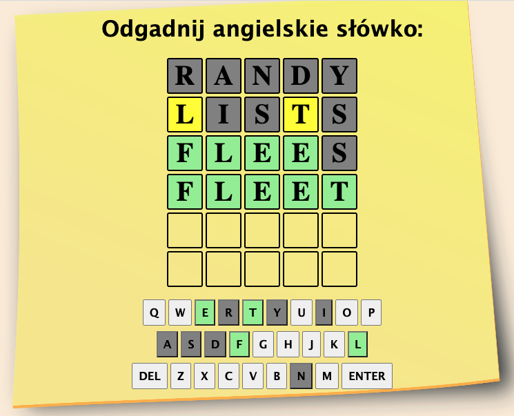

# Worldle Clone

A fun game clone with base of 5-letter English words. Helps my kids to get familiar with English language.

**Link to project** https://worldle-clone.netlify.app

**Tech used:** HTML, CSS, vanilla JavaScript

## Optimizations to do:

- Implement Polish words base
- Add Polish characters to the on-screen keyboard

## Lessons Learned:

dispatchEvent method which helps emulating physical keyboard keys pressed.
